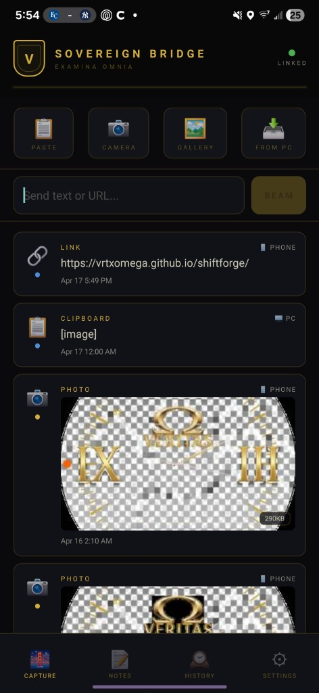
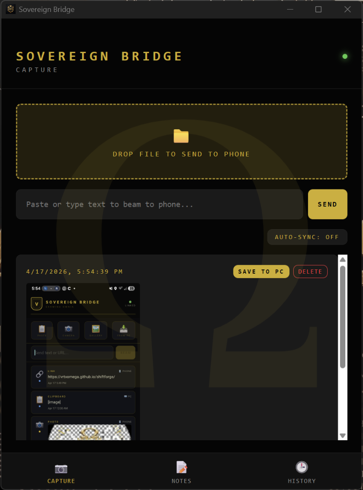

  
  <h1>SOVEREIGN BRIDGE</h1>
  
<strong>Zero-Cloud Cross-Platform Data Synchronization</strong>

  
<em>Absolute E2E encrypted. No intermediary. No cloud storage.</em>

   
  
  
   
  <em>Sovereign Bridge Mobile Application &mdash; VERITAS gold-and-obsidian zero-cloud timeline</em>
  
    
  
  
   
  <em>Sovereign Bridge Desktop Console &mdash; E2EE PC node visualization</em>

---

Sovereign Bridge is a cross-platform clipboard, file, note, and capture sharing system between PC and Android. Architecture: Python aiohttp daemon on PC + React Native mobile app, connected via WebSocket with localtunnel NAT traversal.

> **Data traverses directly from device to device. Zero cloud storage.**

## Architecture

`
+----------------------------+          +----------------------------+
|  MOBILE APP (Android)      |  <-WS->  |  PC DAEMON (Python)        |
|  React Native              |          |  aiohttp + WebSocket       |
|  Clipboard / Camera / Files|          |  Port 5003                 |
+----------------------------+          +----------------------------+
        |                                        |
        +--- localtunnel NAT traversal ----------+
        |                                        |
+----------------------------+          +----------------------------+
|  AES-256 E2EE              |          |  DESKTOP DASHBOARD         |
|  Pre-shared key            |          |  React UI                  |
|  Zero handshake            |          |  Drag-and-drop staging     |
+----------------------------+          +----------------------------+
`

### Cryptographic Guarantees (AES-256 E2EE)

All JSON payloads are encrypted **before** leaving device memory using AES-256-CBC with PKCS7 padding and randomized 16-byte initialization vectors per transmission. Pre-shared key (PSK) architecture — zero key exchange, zero MITM surface.

> **You MUST change the `STATIC_SECRET` in all three source files before deployment.**

## Features

- **Bidirectional Clipboard Sync** - Real-time clipboard sharing with selective gating
- **Native Android Share Intents** - Beam files, photos, text, or URLs via OS share sheet
- **Desktop Notifications** - Windows toast overlays (winotify) for incoming transfers
- **OCR Text Extraction** - Image-to-text for receipts, code, and documents
- **Dropzone Staging** - Drag and drop PC files to transfer to phone
- **Ephemeral + Persistent Lanes** - Choose whether transfers are kept or auto-cleared
- **Project Tagging** - Tag transfers to organize by project context
- **Offline Queue** - Transfers queued when disconnected, delivered on reconnect

## Quick Start

### 1. Boot the Daemon
`ash
cd daemon_and_desktop
pip install -r requirements.txt
python bridge_daemon.py
`

### 2. Launch the Dashboard
`ash
cd daemon_and_desktop/desktop
npm install
npm run dev
`

### 3. Deploy the Mobile App
`ash
cd mobile_app
npm install
npm run android
`

## 🌐 VERITAS Omega Ecosystem

This project is part of the [VERITAS Omega Universe](https://github.com/VrtxOmega/veritas-portfolio) — a sovereign AI infrastructure stack.

- [VERITAS-Omega-CODE](https://github.com/VrtxOmega/VERITAS-Omega-CODE) — Deterministic verification spec (10-gate pipeline)
- [omega-brain-mcp](https://github.com/VrtxOmega/omega-brain-mcp) — Governance MCP server (Triple-A rated on Glama)
- [Gravity-Omega](https://github.com/VrtxOmega/Gravity-Omega) — Desktop AI operator platform
- [Ollama-Omega](https://github.com/VrtxOmega/Ollama-Omega) — Ollama MCP bridge for any IDE
- [OmegaWallet](https://github.com/VrtxOmega/OmegaWallet) — Desktop Ethereum wallet (renderer-cannot-sign)
- [veritas-vault](https://github.com/VrtxOmega/veritas-vault) — Local-first AI knowledge engine
- [sovereign-arcade](https://github.com/VrtxOmega/sovereign-arcade) — 8-game arcade with VERITAS design system
- [SSWP](https://github.com/VrtxOmega/sswp-mcp) — Deterministic build attestation protocol
## License

MIT

---

  Built by <a href="https://github.com/VrtxOmega">RJ Lopez</a> | VERITAS Framework

